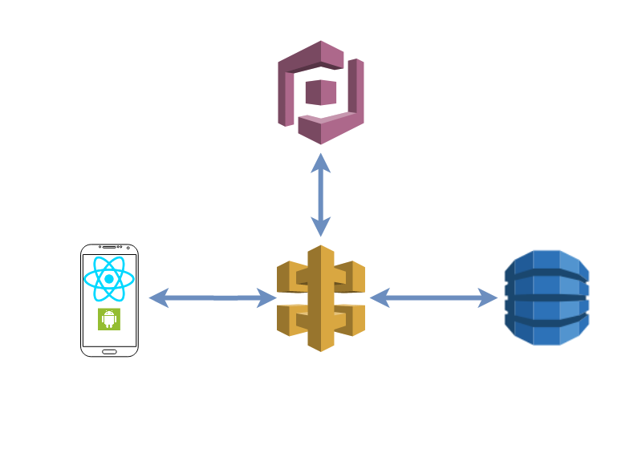
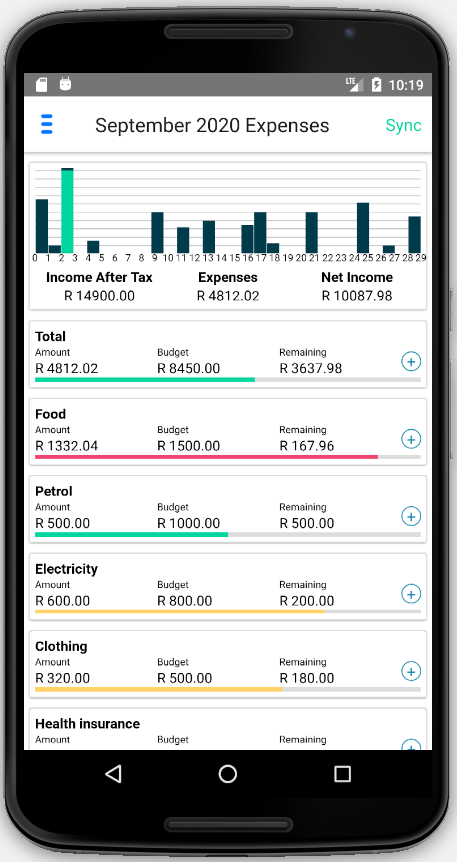
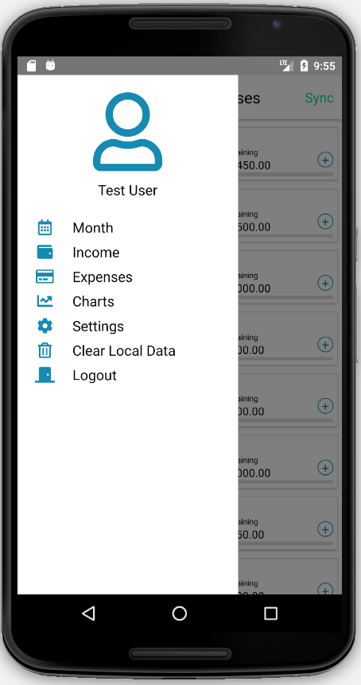
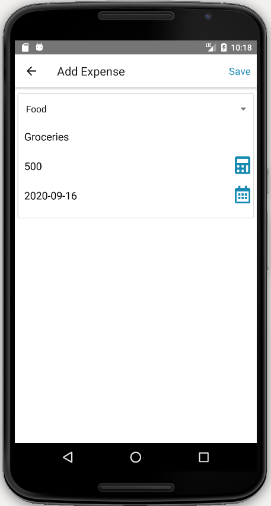
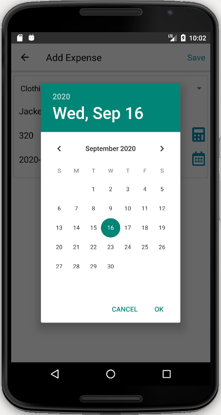
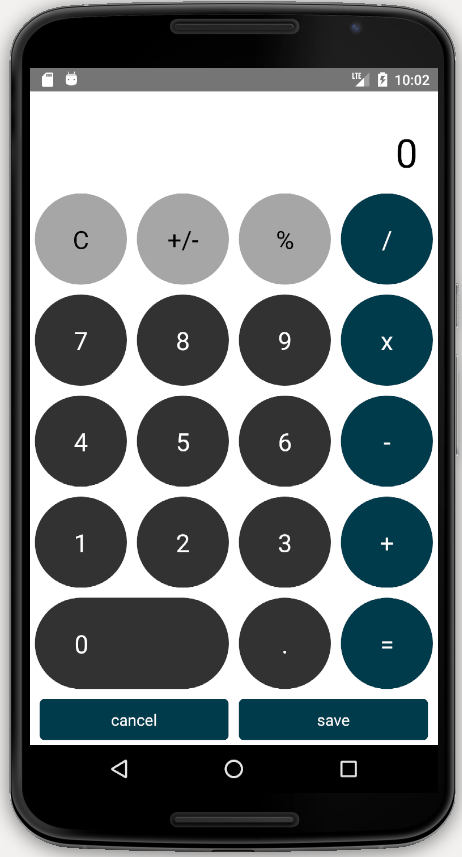
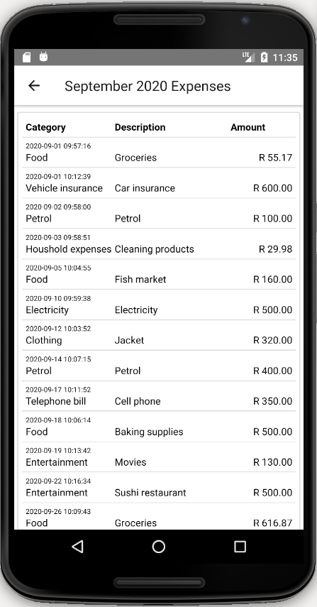
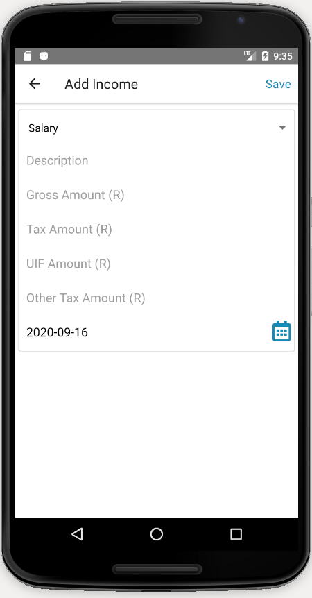
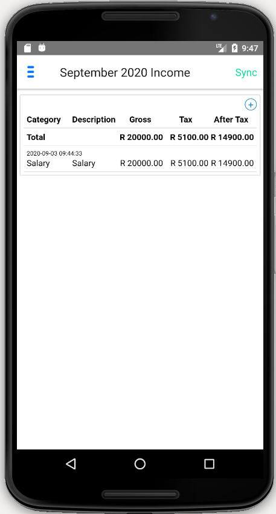
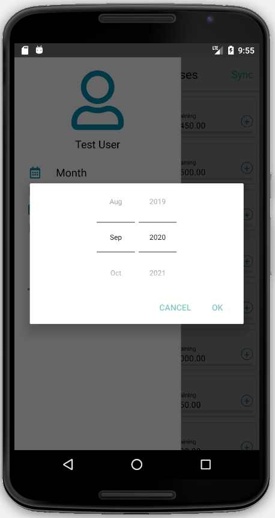

# Android React Native App
An Android app to keep track of my monthly expenses.  The data is synced with an AWS DynamoDB database.

This project contains source code and supporting files for the following post.
http://iwankruger.com/posts/expense_logger

The backend repository can be found [here](https://github.com/iwankruger/expense_logger_backend).

AWS Cognito Credentials must be added to the authConfig.js file.

## Deploy app on Android Studio Emulator
sudo react-native run-android  
sudo react-native start

## To create an apk file
cd android  
sudo ./gradlew assembleRelease  
find apk in android/app/build/outputs/apk/release/app-release.apk
